<h2>TensorFlow-FlexUNet-Image-Segmentation-UWM-GI-Tract (2026/08/14)</h2>
Sarah T. Arai 
Software Laboratory antillia.com  
This is the first experiment of Image Segmentation for <b>UW-Madison GI Tract Image</b>  
based on our <a href="https://github.com/sarah-antillia/TensorFlow-FlexUNet-Image-Segmentation-Model">
TensorFlow-FlexUNet-Image-Segmentation-Model</a> (TensorFlow Flexible UNet Image Segmentation Model for Multiclass) , 
and a 512x512 pixels upscaled <a href="https://drive.google.com/file/d/1yiy_7KxHn1X4wLFNzJNdRlHCJik69kbA/view?usp=sharing">
<b>UWM-GI-Tract-ImageMask-Dataset.zip</b></a> with colorized masks, which was derived by us from   
<a href="https://www.kaggle.com/datasets/purplejester/uwm-images-and-masks">
<b>UWM Images and Masks</b>
</a> by Ilia Zaitsev.
  

<b>Actual Image Segmentation for UWM-GI-Tract Images of 512x512 pixels</b> 
As shown below, the inferred masks predicted by our segmentation model trained by our dataset appear 
similar to the ground truth masks.  
<b>class_color_map = {Small_Bowel:yellow, Large_Bowel:green, Stomach:red}</b> 
 
<table>
<tr>
<th>Input: image</th>
<th>Mask (ground_truth)</th>
<th>Prediction: inferred_mask</th>
</tr>
<tr>
<td>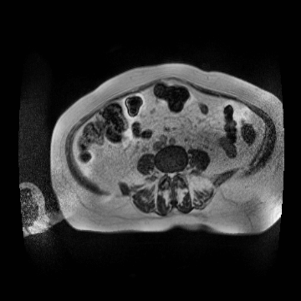</td>
<td>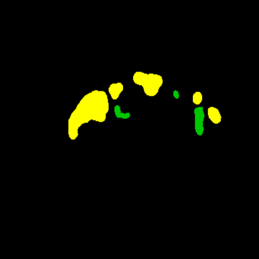</td>
<td>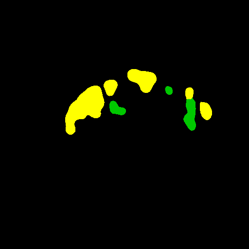</td>
</tr>
<tr>
<td>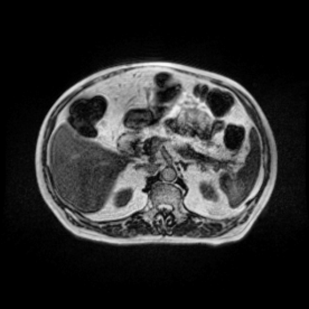</td>
<td>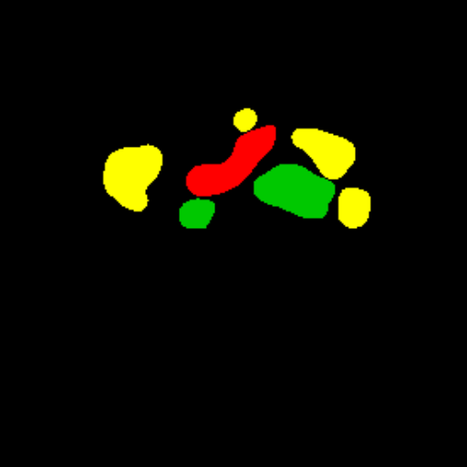</td>
<td>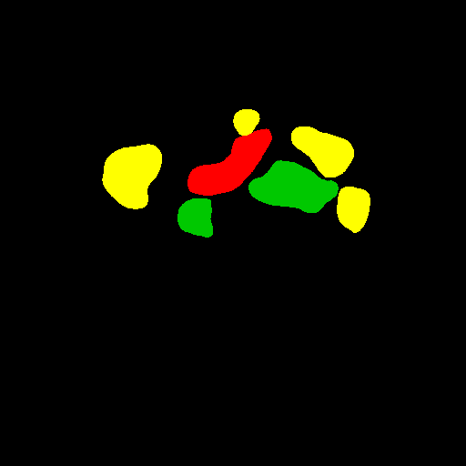</td>
</tr>
<tr>
<td>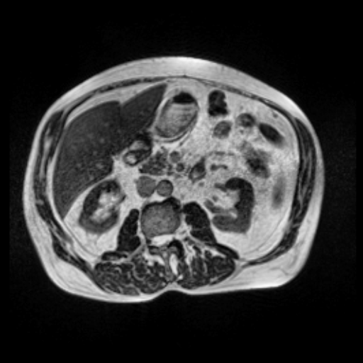</td>
<td>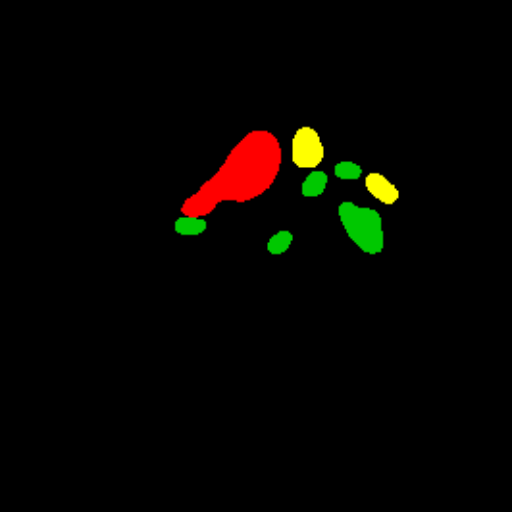</td>
<td>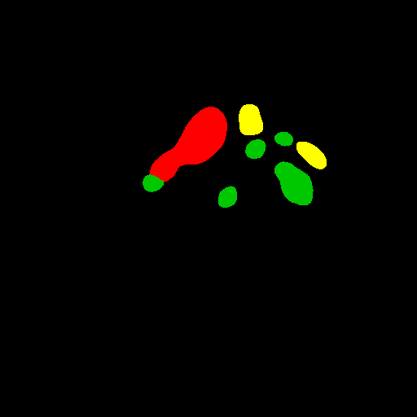</td>
</tr>
</table>

 
<h3>1  Dataset Citation</h3>
The dataset used here was derived from   
<a href="https://www.kaggle.com/datasets/purplejester/uwm-images-and-masks">
<b>UWM Images and Masks</b>
</a>  
UW-Madison GI Tract Image Segmentation: Preprocessed Dataset
 by Ilia Zaitsev.
  
The following explanation was taken from the website above.  

<b>About Dataset</b> 
This dataset is a pre-processed version of the 
<a href="https://www.kaggle.com/competitions/uw-madison-gi-tract-image-segmentation">
UW-Madison GI Tract Image Segmentation data.</a>
 
It has the following structure: 
<ul>
<li>image_props.csv - some basic information about sample</li>
<li>images - samples in PNG format (same as the original dataset)</li>
<li>masks - decoded masks in PNG format (the original dataset provides them in RLE format)</li>
</ul>
This derived dataset is created to make it a bit simpler to work with than the original. All rights reserved to the respective owners.
  
<b>Acknowledgments:</b> 
Sangjune Laurence Lee MSE MD FRCPC DABR 
Poonam Yadav Ph.D., DABR 
Yin Li PhD 
Jason J. Meudt BS, RTT 
Jessica Strang 
Dustin Hebel 
Alyx Alfson MS CMD, R.T.(T) 
Stephanie J. Olson RTT (BS), CMD (MS) 
Tera R. Kruser MS, RTT, CMD 
Jennifer B Smilowitz, Ph.D., DABR, FAAPM 
Kailee Borchert 
Brianne Loritz 
John Bayouth PhD 
Michael Bassetti MD PhD  
Work funded by the University of Wisconsin Carbone Cancer Center Pancreas Pilot Research Grant.

  
<b>License</b> 
Data files © Original Authors 
 
<h3>
2 UWM-GI-Tract ImageMask Dataset
</h3>
 If you would like to train this UWM-GI-Tract Segmentation model by yourself,
 please download the original dataset from the google drive  
<a href="https://drive.google.com/file/d/1yiy_7KxHn1X4wLFNzJNdRlHCJik69kbA/view?usp=sharing">
<b>UWM-GI-Tract-ImageMask-Dataset.zip</b></a>
, expand the downloaded, and put it under <b>./dataset </b> folder to be: 
<pre>
./dataset
└─UWM-GI-Tract
    ├─test
    │   ├─images
    │   └─masks
    ├─train
    │   ├─images
    │   └─masks
    └─valid
        ├─images
        └─masks
</pre>
 
<b>UWM-GI-Tract Statistics</b> 
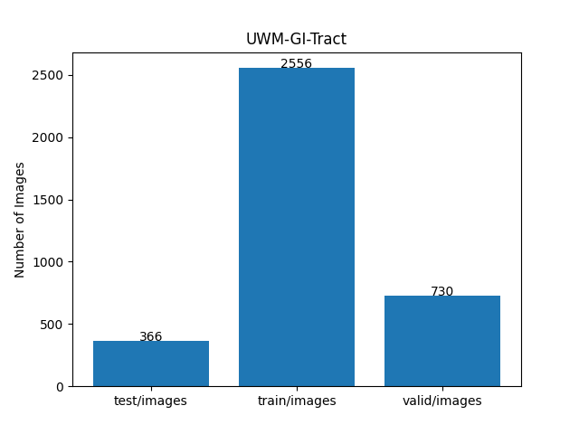 
 
As shown above, the number of images of train and valid datasets is large enough to use for a training set of our segmentation model.
 
 
<b>Train_images_sample</b> 
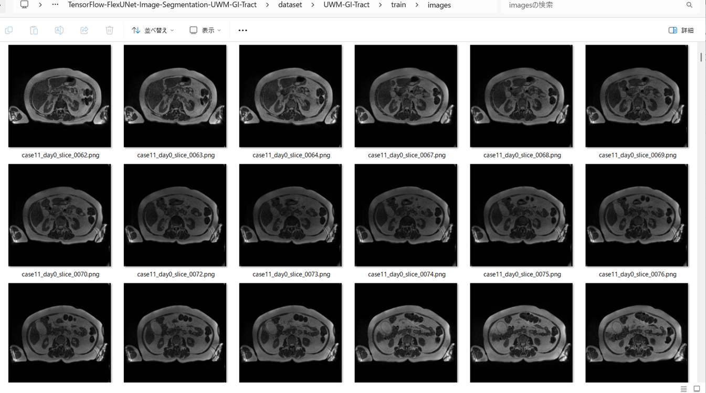
 
<b>Train_masks_sample</b> 
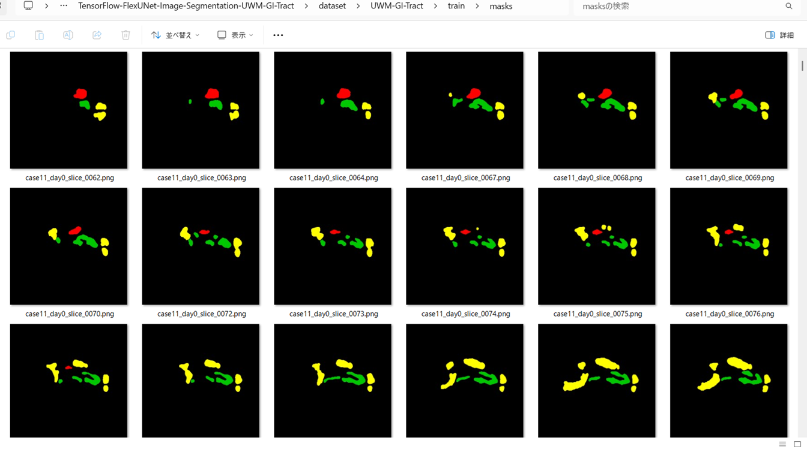
 
<h3>
3 Train TensorflowFlexUNet Model
</h3>
 We trained UWM-GI-Tract TensorflowFlexUNet Model by using the following
<a href="./projects/TensorFlowFlexUNet/UWM-GI-Tract/train_eval_infer.config"> <b>train_eval_infer.config</b></a> file.  
Please move to <b>./projects/TensorFlowFlexUNet/UWM-GI-Tract</b> folder and run the following bat file. 
<pre>
>1.train.bat
</pre>
, which simply runs the following command. 
<pre>
>python ../../../src/TensorFlowFlexUNetTrainer.py ./train_eval_infer.config
</pre>

<b>Model parameters</b> 
Defined a small <b>base_filters=16</b> and a large <b>base_kernels=(11,11)</b> for the first Conv Layer of Encoder Block of 
<a href="./src/TensorFlowFlexUNet.py">TensorFlowFlexUNet.py</a> 
and a large <b>num_layers=8</b> (including a bridge between Encoder and Decoder Blocks).
<pre>
[model]
image_width    = 512
image_height   = 512
image_channels = 3
input_normalize = True
normalization  = False
num_classes    = 4
base_filters   = 16
base_kernels   = (11,11)
num_layers     = 8
dropout_rate   = 0.05
dilation       = (1,1)
</pre>

<b>Learning rate</b> 
Defined a small learning rate.  
<pre>
[model]
learning_rate  = 0.00007
</pre>

<b>Loss and metrics functions</b> 
Specified "categorical_crossentropy" and "dice_coef_multiclass". 
<pre>
[model]
loss           = "categorical_crossentropy"
metrics        = ["dice_coef_multiclass"]
</pre>
<b >Learning rate reducer callback</b> 
Enabled learing_rate_reducer callback, and a small reducer_patience.
<pre> 
[train]
learning_rate_reducer = True
reducer_factor     = 0.5
reducer_patience   = 4
</pre>
<b>Early stopping callback</b> 
Enabled early stopping callback with patience parameter.
<pre>
[train]
patience      = 10
</pre>
<b></b> 
<b>RGB color map</b> 
rgb color map dict for UWM-GI-Tract 1+3 classes. 
<pre>
[mask]
mask_file_format = ".png"
;UWM-GI-Tract 1+3               
; Background:black, Small_Bowel:yellow, Large_Bowel:green, Stomach:red
rgb_map = {(0,0,0):0,(255,255,0):1,(0,200,0):2255,0,0):3}
</pre>
<b>Epoch change inference callbacks</b> 
Enabled epoch_change_infer callback. 
<pre>
[train]
epoch_change_infer       = True
epoch_change_infer_dir   =  "./epoch_change_infer"
epoch_changeinfer        = False
epoch_changeinfer_dir    = "./epoch_changeinfer"
num_infer_images         = 6
</pre>
By using this epoch_change_infer callback, on every epoch_change, the inference procedure can be called
 for 6 images in <b>mini_test</b> folder. This will help you confirm how the predicted mask changes 
 at each epoch during your training process.    
<b>Epoch_change_inference output at starting (1,2,3)</b> 
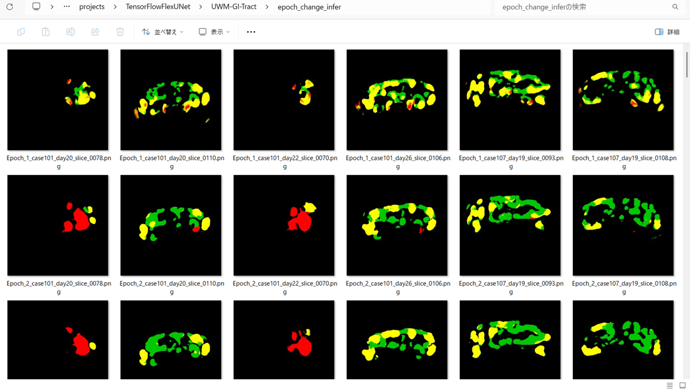 
 
<b>Epoch_change_inference output at ending (18,19,20)</b> 
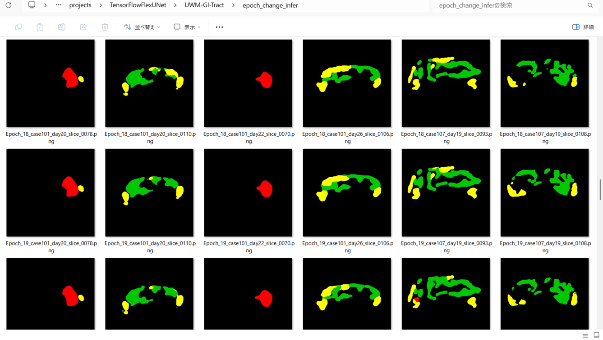 
 
<b>Epoch_change_inference output at ending (38,39,40)</b> 
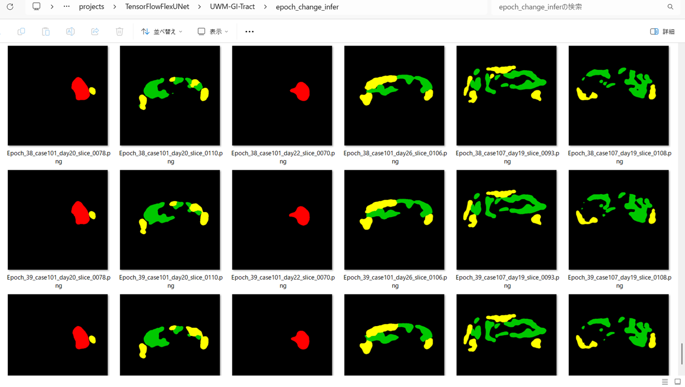 

 
In this experiment, the training process was terminated at epoch 40.  
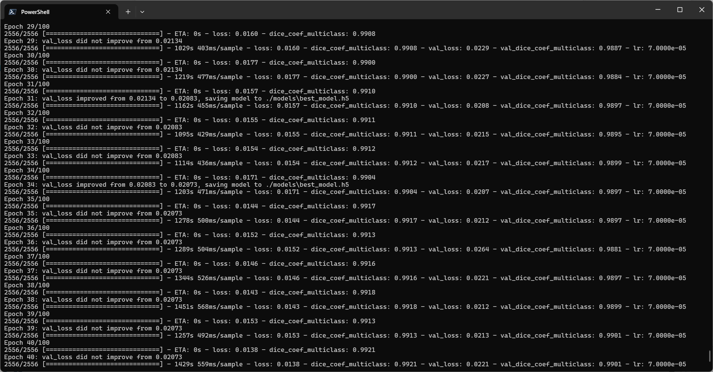 
 
<a href="./projects/TensorFlowFlexUNet/UWM-GI-Tract/eval/train_metrics.csv">train_metrics.csv</a> 
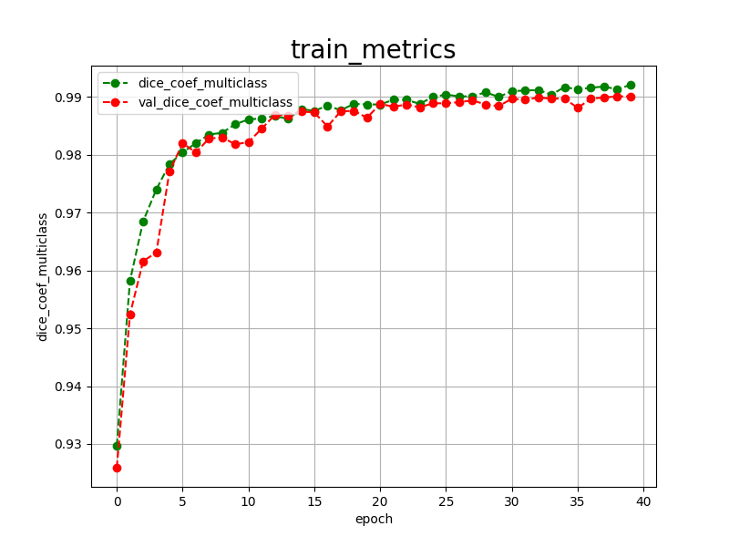 

 
<a href="./projects/TensorFlowFlexUNet/UWM-GI-Tract/eval/train_losses.csv">train_losses.csv</a> 
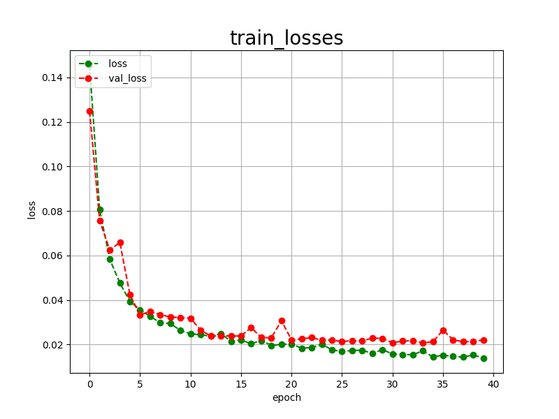 
 
<h3>
4 Evaluation
</h3>
Please move to <b>./projects/TensorFlowFlexUNet/UWM-GI-Tract</b> folder,
and run the following bat file to evaluate TensorflowFlexUNet model for UWM-GI-Tract. 
<pre>
>./2.evaluate.bat
</pre>
This bat file simply runs the following command.
<pre>
>python ../../../src/TensorFlowFlexUNetEvaluator.py  ./train_eval_infer.config
</pre>
Evaluation console output: 
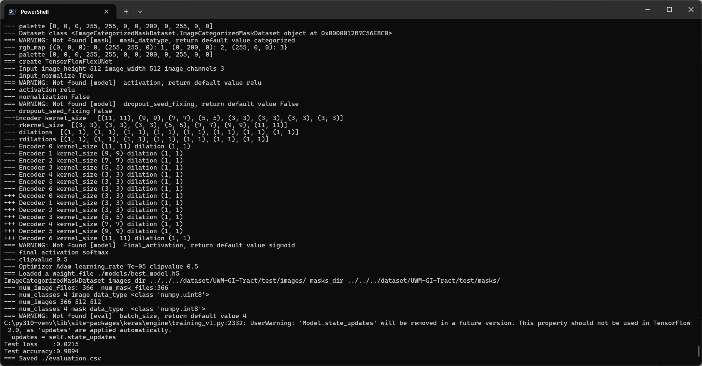
  Image-Segmentation-UWM-GI-Tract
<a href="./projects/TensorFlowFlexUNet/UWM-GI-Tract/evaluation.csv">evaluation.csv</a> 
The loss (categorical_crossentropy) to this UWM-GI-Tract/test was low, and dice_coef_multiclass high as shown below.
 
<pre>
categorical_crossentropy,0.0215
dice_coef_multiclass,0.9894
</pre>
 
<h3>5 Inference</h3>
Please move to <b>./projects/TensorFlowFlexUNet/UWM-GI-Tract</b> folder 
,and run the following bat file to infer segmentation regions for images by the Trained-TensorflowFlexUNet model for UWM-GI-Tract. 
<pre>
>./3.infer.bat
</pre>
This simply runs the following command.
<pre>
>python ../../../src/TensorFlowFlexUNetInferencer.py ./train_eval_infer.config
</pre>

<b>mini_test_images</b> 
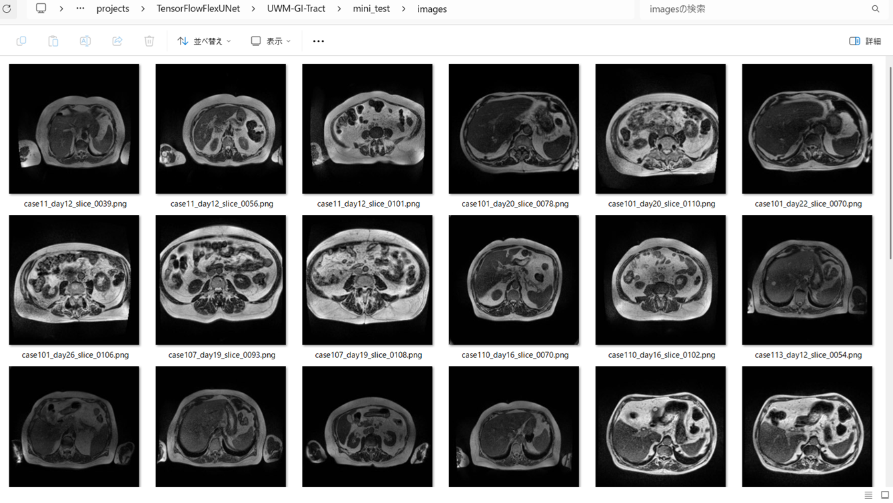 
<b>mini_test_mask(ground_truth)</b> 
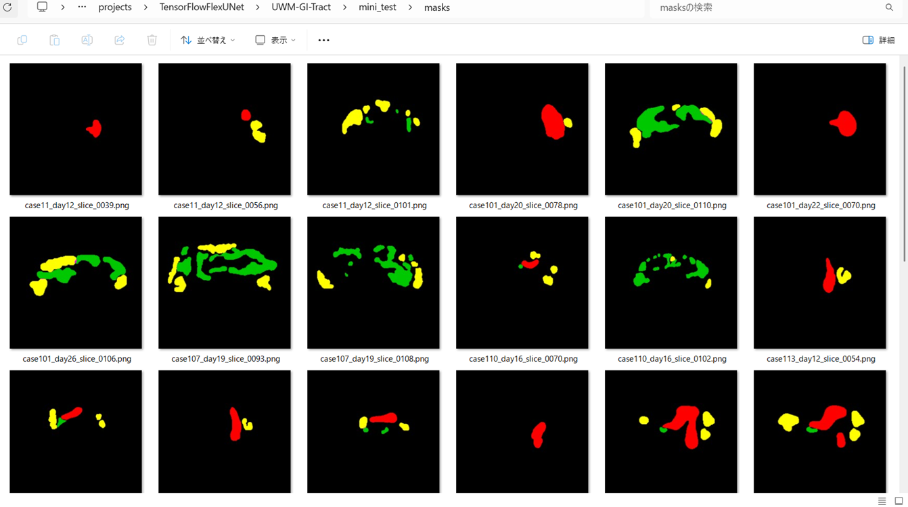 

<b>Inferred test masks</b> 
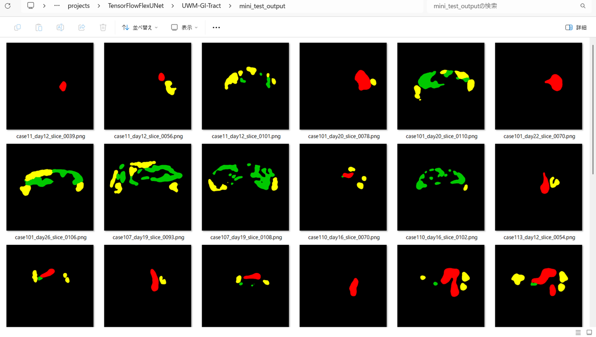 
 

<b>Enlarged images and masks for UWM-GI-Tract Images of 650x650 pixels</b> 
As shown below, the inferred masks predicted by our segmentation model trained by our dataset appear similar to the ground truth masks.
 
 
<b>class_color_map = {Small_Bowel:yellow, Large_Bowel:green, Stomach:red}</b>  
<table>
<tr>
<th>Input: image</th>
<th>Mask (ground_truth)</th>
<th>Prediction: inferred_mask</th>
</tr>
<tr>
<td>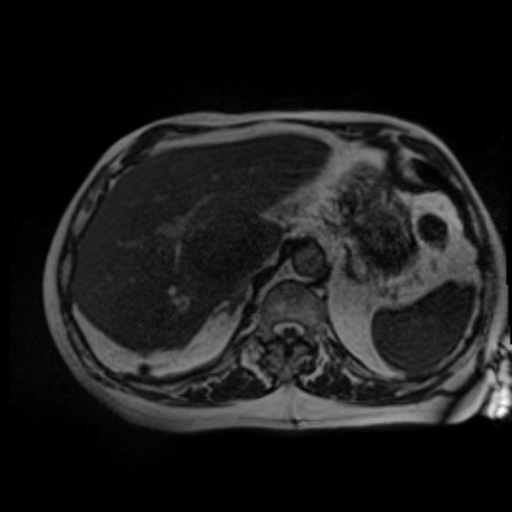</td>
<td>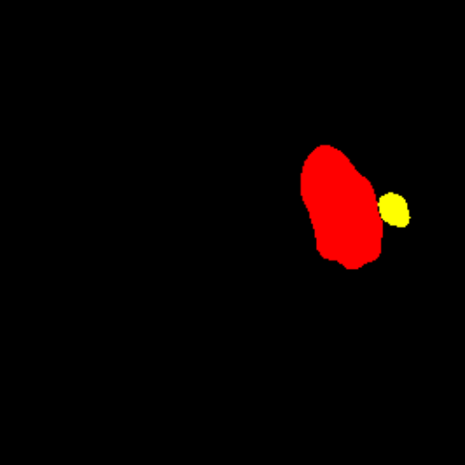</td>
<td></td>
</tr>
<tr>
<td>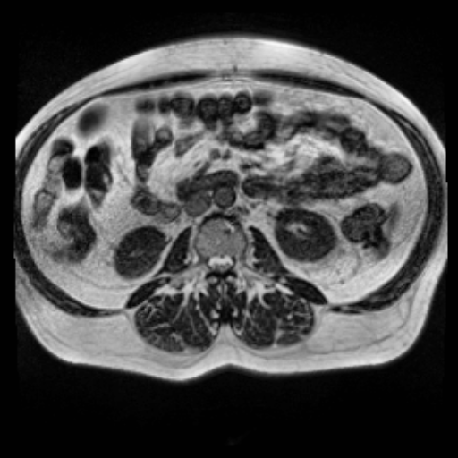</td>
<td>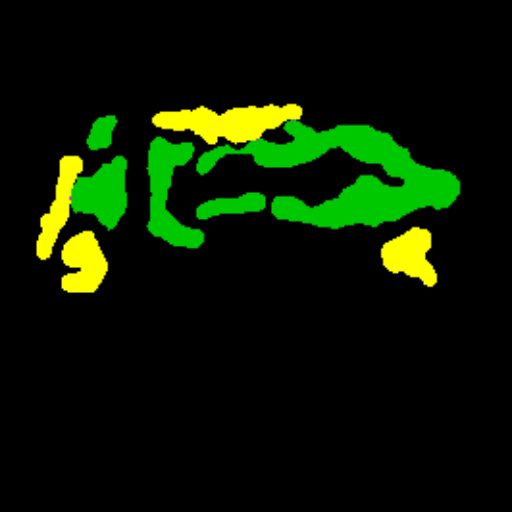</td>
<td>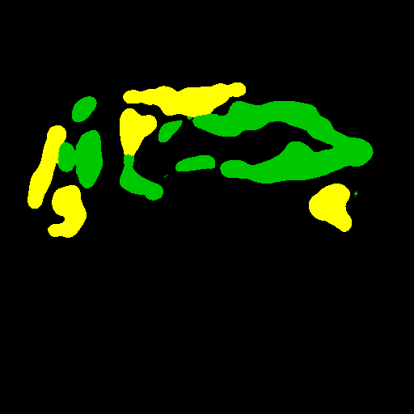</td>
</tr>
<tr>
<td>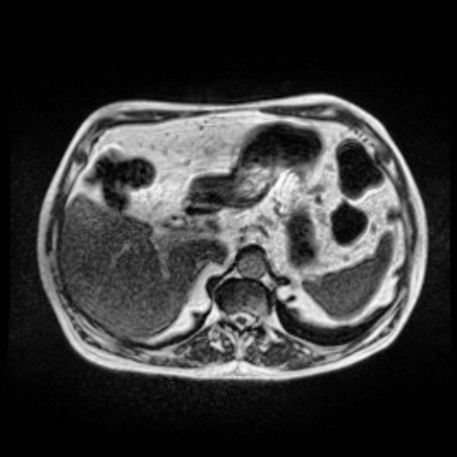</td>
<td></td>
<td>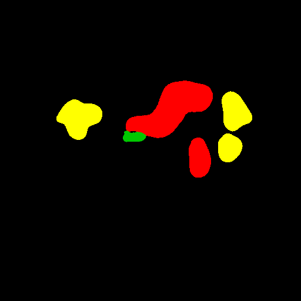</td>
</tr>
<tr>
<td></td>
<td></td>
<td></td>
</tr>
<tr>
<td>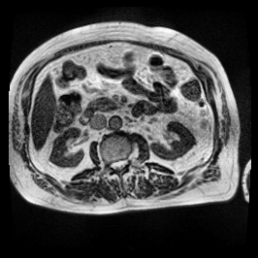</td>
<td>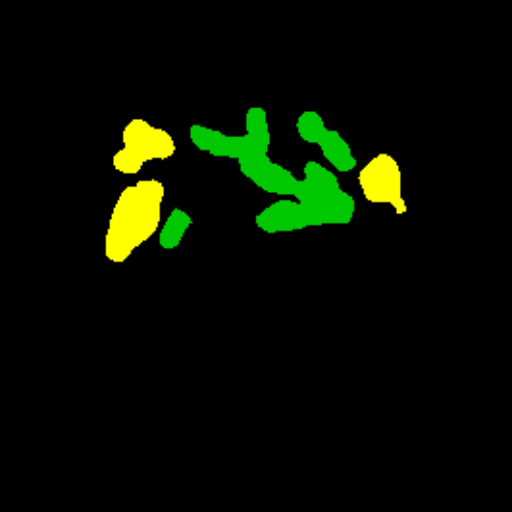</td>
<td></td>
</tr>
<tr>
<td></td>
<td></td>
<td></td>
</tr>
</table>

 
<h3>
References
</h3>
<b>1. UW-Madison_GI_Tract_Image_Segmentation</b> 
OpenMEDLab 
<a href="https://github.com/openmedlab/Awesome-Medical-Dataset/blob/main/resources/UW-Madison_GI_Tract_Image_Segmentation.md">
https://github.com/openmedlab/Awesome-Medical-Dataset/blob/main/resources/UW-Madison_GI_Tract_Image_Segmentation.md</a>
 
 
<b>2. TensorFlow-FlexUNet-Image-Segmentation-CURVAS-MICCAI2024-Abdominal-MultiOrgan </b> 
Toshiyuki Arai 
<a href="https://github.com/sarah-antillia/TensorFlow-FlexUNet-Image-Segmentation-CURVAS-MICCAI2024-Abdominal-MultiOrgan">
https://github.com/sarah-antillia/TensorFlow-FlexUNet-Image-Segmentation-CURVAS-MICCAI2024-Abdominal-MultiOrgan</a>
 
 
<b>3. TensorFlow-FlexUNet-Image-Segmentation-Synapse-Abdominal-MultiOrgan</b> 
Toshiyuki Arai 
<a href="https://github.com/sarah-antillia/TensorFlow-FlexUNet-Image-Segmentation-Synapse-Abdominal-MultiOrgan">
https://github.com/sarah-antillia/TensorFlow-FlexUNet-Image-Segmentation-Synapse-Abdominal-MultiOrgan</a>
 
 
<b>4. TensorFlow-FlexUNet-Image-Segmentation-Model</b> 
Toshiyuki Arai  
<a href="https://github.com/sarah-antillia/TensorFlow-FlexUNet-Image-Segmentation-Model">
https://github.com/sarah-antillia/TensorFlow-FlexUNet-Image-Segmentation-Model
</a>
 
 
